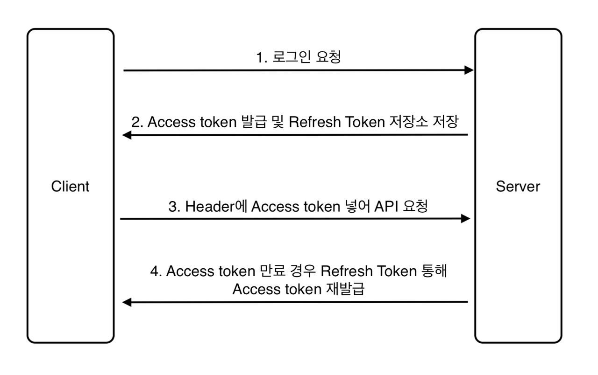

1. 토큰기반 인증  
인증에 토큰을 사용하는 방식이다.  
토큰은 클라이언트를 구분하는데 사용하는 유일한 값이다.  
서버에서 생성해서 클라이언트에게 제공한 뒤, 클라이언트는 서버에 요청할 때마다 요청 내용과 함께 토큰을 정송한다.  
서버에서는 토큰으로 유효한 사용자인지 검증한다.  

2. JWT  
JWT는 토큰 기반 인증에서 주로 사용하는 토큰이다.  
JSON 형식으로 사용자(클라이언트)의 정보를 저장한다.  
JWT는 Header, Payload, Signature 구조로 이루어져 있다.  

| JWT 구조  | 설명                             | 	예                                                                                                    |
|---------|--------------------------------|-------------------------------------------------------------------------------------------------------|
| Header	 | 토큰 유형과 사용한 서명 알고리즘의 두 부분으로 구성	 | {    "alg": "HS256",     "typ": "JWT"     }   |
|Payload|	사용자 및 추가 데이터에 대한 설명인 Claim을 포함  Payload에는 사용자의 비밀번호와 같은 중요한 정보는 포함시키지 않음	| {   "sub": "1234567890",     "name": "John Doe",     "admin": true     }              |
|Signature	|토큰이 전달되는 도중에 변경되지 않았는지 확인	| HMACSHA256(     base64UrlEncode(header) + "." +     base64UrlEncode(payload),     secret) |

3. 리프레스 토큰  
액세스 토큰과 별개의 토큰  
액세스 토큰이 만료되었을때 새로운 액세스 토큰을 발급받는 용도로 사용한다.  

4. 필터  
실제로 요청이 전달되기 전과 후에 URL 패턴에 맞는 요청을 처리하는 기능 제공.  

5. 시큐리티 콘텍스트  
인증 객체가 저장되는 보관소.  
인증정보가 필요할때 언제든지 인증 객체를 꺼내어 사용하도록 제공되는 클래스.  
이러한 시큐리티 컨텍스트 객체를 저장하는 객체가 시큐리티 컨텍스트 홀더이다.
